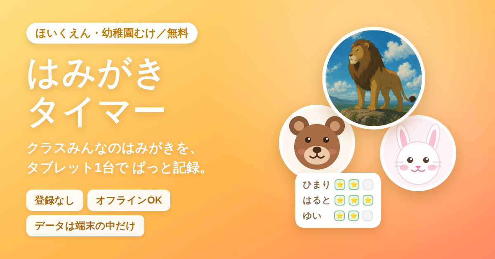
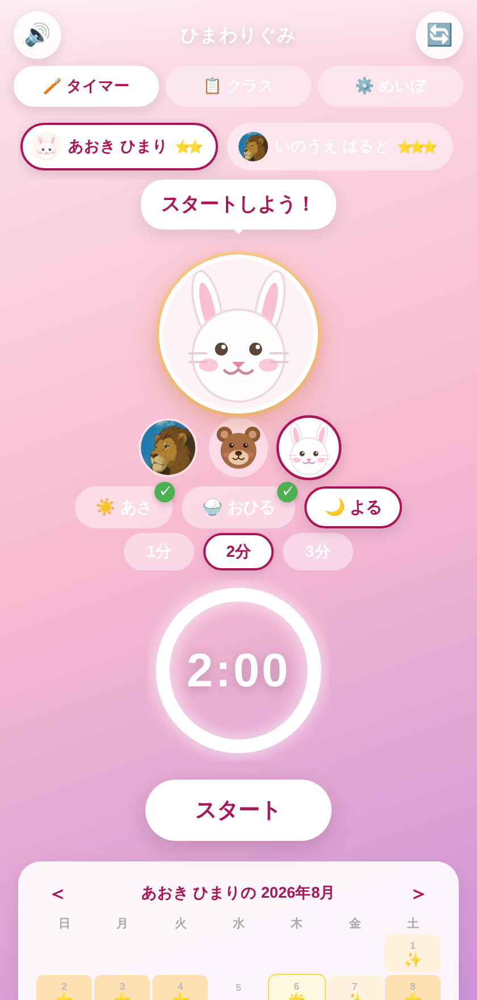
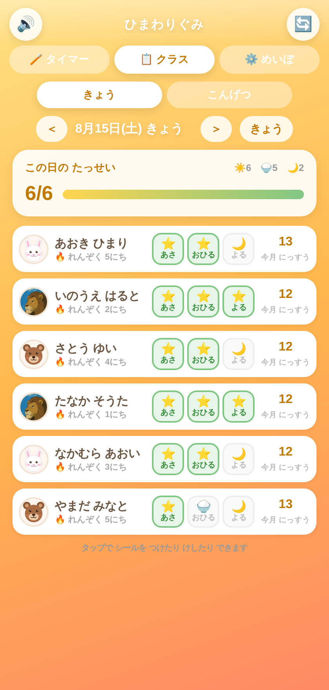
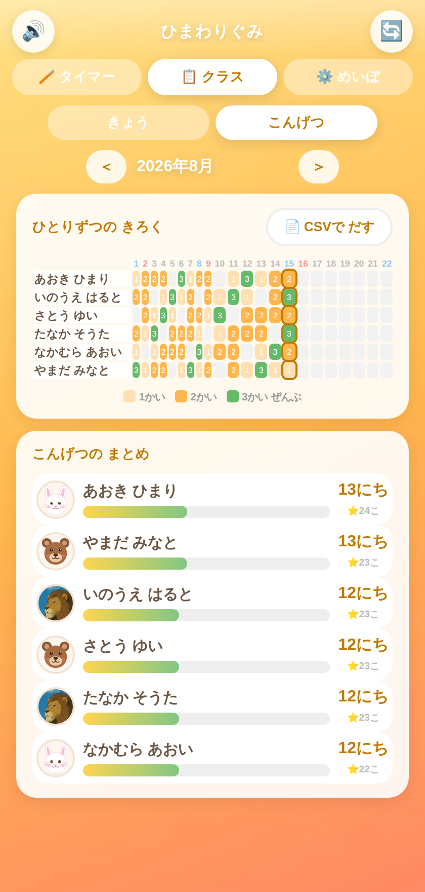
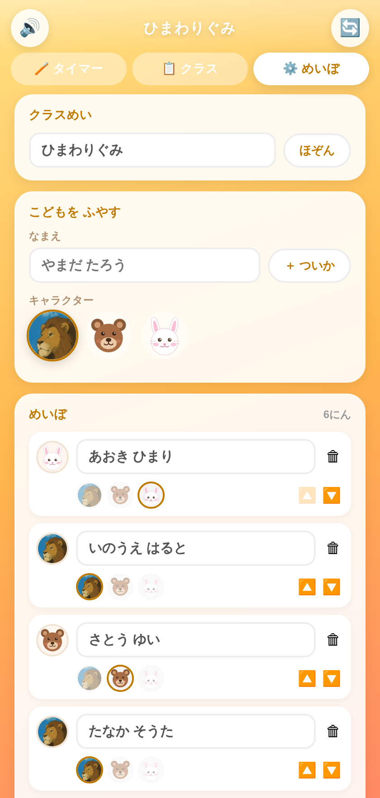

# 🦁 はみがきタイマー（ほいくえん版）

保育園・幼稚園で使える、**クラスみんなのはみがきタイマー＆記録アプリ**です。
インストール不要・登録不要・無料。ブラウザだけで動きます。

👉 **[アプリをひらく](https://tomonori2.github.io/hamigaki-timer/)**

## できること

| 子ども向け | 先生向け |
| --- | --- |
| キャラクター（ライオン・くま・うさぎ）と一緒にはみがき | クラス全員の達成状況をひと目で確認 |
| 1〜3分のタイマーと「右上・左上・右下・左下」のみがく場所ガイド | タップでシールを付け外し（タイマーを使わなかった分も記録） |
| 終わると花火とファンファーレでごほうび | 1か月分をマトリクスで確認・CSV書き出し |
| 自分のカレンダーにスタンプがたまる | 名簿の管理、バックアップの保存・読み込み |

## つかいかた

1. タブレット（またはスマホ・PC）のブラウザで [アプリのURL](https://tomonori2.github.io/hamigaki-timer/) をひらく
2. **⚙️ めいぼ** でクラス名と園児を登録する（キャラクターも選べます）
3. **🪥 タイマー** で子どもを選んで「スタート」
4. **📋 クラス** でその日の達成状況を確認。付け忘れはタップで追加できます

### ホーム画面に追加すると、アプリのように使えます

- **iPad / iPhone（Safari）**：共有ボタン → 「ホーム画面に追加」
- **Android（Chrome）**：右上のメニュー → 「アプリをインストール」／「ホーム画面に追加」

一度ひらけばオフラインでも動くので、園のWi‑Fiが不安定でも使えます。

## データについて

- 記録は**その端末のブラウザの中だけ**に保存されます（localStorage）。サーバーには送られず、外部に共有されることもありません
- そのため、**端末ごとに記録は別々**です。複数の端末で共有したい場合は、バックアップ（JSON）の書き出し／読み込みで移してください
- ブラウザのデータ削除・シークレットモード・端末の入れ替えで記録は消えます。**ときどきバックアップの保存**をおすすめします
- 園児の名前を入力して使うため、**園の個人情報の取り扱いルールに沿ってご利用ください**（端末の管理・パスコードなど）。名前をイニシャルや番号にして使うこともできます

## ファイル構成

| ファイル | 内容 |
| --- | --- |
| `index.html` | アプリ本体（HTML/CSS/JS・画像・BGMをすべて内包した1ファイル） |
| `manifest.json` / `sw.js` | PWA設定・オフライン用のService Worker |
| `ogp.png` | SNSでリンクを貼ったときのカード画像 |
| `promo/` | 配布用のチラシ・QRコード・告知文テンプレート |
| `docs/` | 画面のスクリーンショット |

## つくり

外部ライブラリを使わない素のHTML/CSS/JavaScriptです。キャラクターのライオンは画像、くま・うさぎはインラインSVGで描いています。ビルド作業は不要で、`index.html` をブラウザで開けばそのまま動きます。

## ライセンス・お問い合わせ

自由にお使いください。要望・不具合の報告は [Issues](https://github.com/Tomonori2/hamigaki-timer/issues) までどうぞ。
